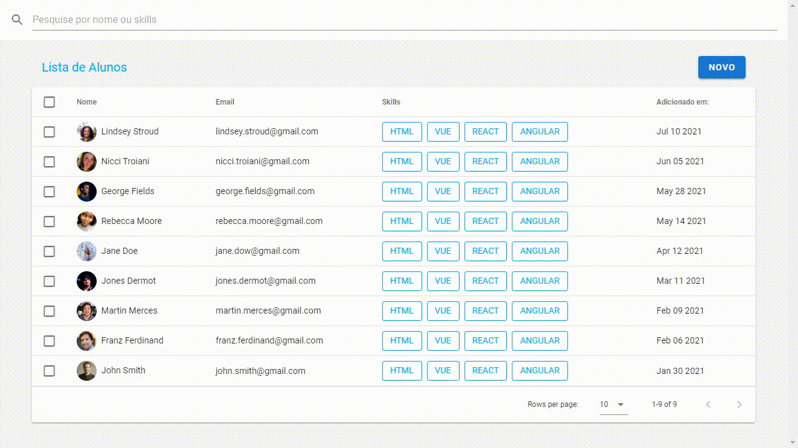

# Aprendendo Vuetify

### Aplicação para cadastro e listagens de alunos.

### Tecnologias utilizadas: 

### Demonstração

    

### Como executar

- Clone o repositório
- Instale as dependências com `npm install` ou `yarn`
- Inicie a aplicação com `npm run serve` ou `yarn serve`
